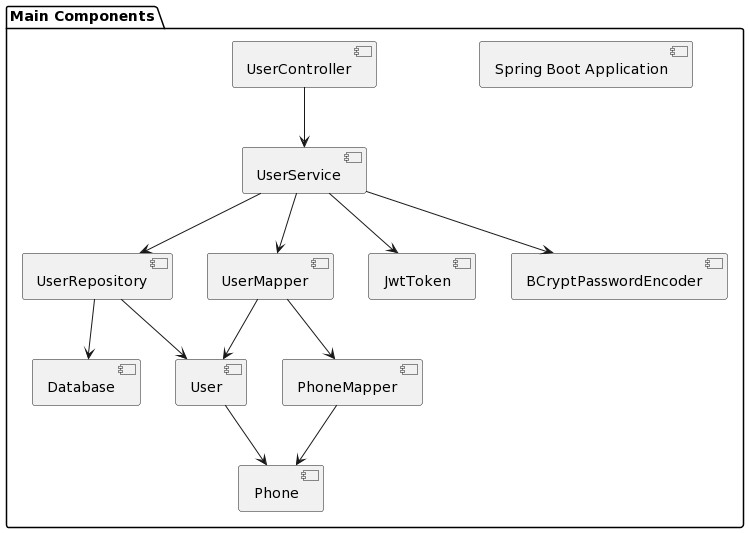

# API para creación y consula de Usuario

Se creo una Api segun la consigna dada para ser evaluado por la empresa Globalogic.

## Consigna
El archivo de consigna está disponible [aquí](src/main/resources/static/consigna.pdf).

## Instrucciones de Construcción y Ejecución

1. Clona el repositorio: `git clone <enlace_del_repositorio>`.
2. Navega al directorio del proyecto: `cd nombre_del_proyecto`.
3. Construye el proyecto: `./gradlew build`.
4. Ejecuta el proyecto: `./gradlew bootRun`.

## Tecnologías Utilizadas

- Java 11
- Spring Boot 2.7.17
- Gradle 8.4
- Swagger para documentación de la API
- H2 Database para persistencia
- Token JWT

## Diagrama de Secuencia

A continuación, se presenta el diagrama de secuencia para el flujo principal de la aplicación:


## Diagrama de Componentes

Este diagrama de componentes ofrece una visión general de la estructura de componentes de la aplicación:




# API Documentation

El servidor estará disponible en http://localhost:8080.

## Endpoints

### /sign-up

Endpoint para la creación de un nuevo usuario.

**Método:** POST

**Contrato de Entrada:**
```json
{
  "name": "String",
  "email": "String",
  "password": "String",
  "phones": [
    {
      "number": "long",
      "cityCode": "int",
      "countryCode": "String"
    }
  ]
}
```
**Respuesta Exitosa:**
```json
{
  "id": "UUID",
  "created": "Fecha",
  "lastLogin": "Fecha",
  "token": "JWT",
  "isActive": true
}
```
**Respuesta Error**
```json
{
   "error": [
   {
      "timestamp": "Timestamp",
      "codigo": "int",
      "detail": "String"
   }
   ]
}
```
## /login

Endpoint para consultar la información de un usuario existente.

**Método:** GET

**Contrato de Salida:**
```json
{
  "id": "UUID",
  "created": "Fecha",
  "lastLogin": "Fecha",
  "token": "JWT",
  "isActive": true,
  "name": "String",
  "email": "String",
  "password": "String",
  "phones": [
    {
      "number": "long",
      "cityCode": "int",
      "countryCode": "String"
    }
  ]
}
```

## Swagger

Puedes explorar y probar los endpoints de la API utilizando Swagger. Abre el siguiente enlace en tu navegador:

[Swagger UI](http://localhost:8080/swagger-ui/)
